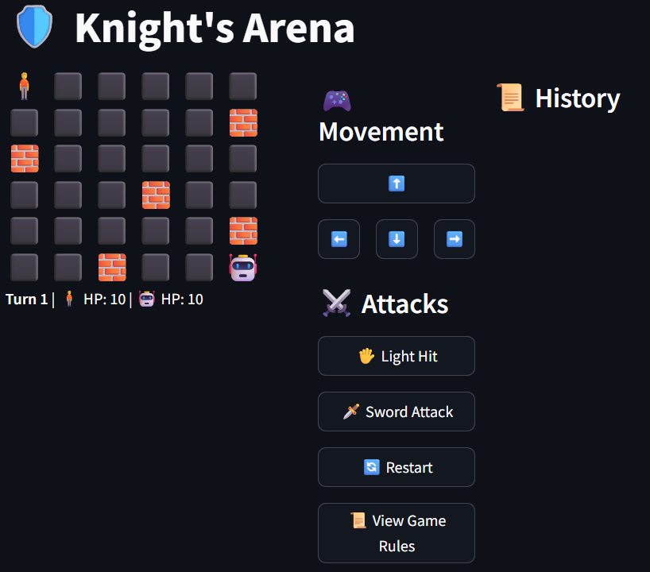

# 🛡️ Knight's Arena

Knight's Arena is a tactical, turn-based AI battle game developed in Python.  
The player navigates a 6x6 grid, fighting against an intelligent AI that can attack, retreat when necessary, or move toward healing Power-Ups.  
The game combines strategic decision-making with dynamic elements like walls and health boosts.

---

## 🎮 Game Features

- 🧍 Player and 🤖 AI movement on a 6x6 grid.
- ⚔️ Sword Attack (with cooldown) and Light Hit options.
- 🧱 Random walls block paths, making movement tactical.
- 💊 Power-Ups appear every 5 turns and expire after 3 turns.
- 🤖 AI smartly attacks, retreats when health is low, and collects Power-Ups when beneficial.
- 📜 Battle history log tracking each move and action.
- 🔄 Restart game at any time.
- 📜 View Game Rules interactively.

---

## 🚀 Live Applications

- 🌐 [Streamlit Application](https://game-mhnd.streamlit.app/)
- 📚 [Google Colab (Gradio App)](https://colab.research.google.com/drive/11TvxePHKRvBAR8qPdyCENRWKeAmNTSlG?usp=sharing)
- 💾 [GitHub Repository](https://github.com/Muhannadam/knights_arena_app/tree/main)

---

## 🕹️ How to Play

- Use arrow buttons (⬆️⬇️⬅️➡️) to move your knight.
- Attack the AI when adjacent using Light Hit (🖐) or Sword Attack (🗡️).
- Sword Attack has a 2-turn cooldown.
- Collect Power-Ups (💊) to heal +2 HP.
- Avoid walls (🧱) that block movement.
- Defeat the AI before losing all your HP!

---

## 🖥️ Setup Instructions

### Run with Streamlit
```bash
pip install streamlit
streamlit run app.py
```

### Run with Gradio (Google Colab)
```bash
pip install gradio
# Open and run the Colab notebook provided in the repository
```

---

## 📸 Screenshot



---

## 👨‍💻 Team Members

- **Muhannad Almuntashiri** — 2503649
- **Mohammed Talal Mursi** — 2503652
- **Ghaith Omar Alhumaidi** — 2503650